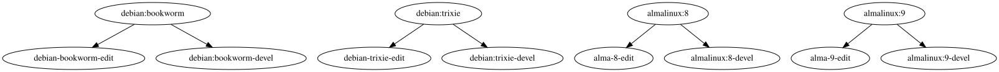

#+title: 🧵 winch is an image node container harness 🧵

* What is *winch*

Said most generally, *winch* is a generator of text (strings or files) using a
hierarchical, parameterized data structure that the user provides in a simple
configuration file.

*winch* also provides special support to generate [[https://podman.io/][podman]] ~Containerfile~ files and build them into *podman* images.

*winch* supports two configuration *paradigms*:

- The original *kind* paradigm where each TOML table names its ~parent_kind~ and
  the tree of image layers is thus baked into the configuration.  This is
  described in sections [[Configuration]] and [[How *winch* works]].

- The newer *layer/recipe* paradigm where stand-alone, parent-free *layers* are
  composed into a build tree only at realization time by *recipes*.  This is
  described in section [[The new paradigm: layers and recipes]].

A given run uses one paradigm or the other; the two are never mixed within the
configuration given to a single ~winch~ invocation (see [[Paradigm detection]]).

* How to use *winch*

This section describes how to install *winch* and run it using a provided example configuration.

** Requirements

*winch* requires Python 3 with the Click and Neworkx packages for the most basic usage.  In addition the ~podman~ command is required to build container images from a *winch* configuration.

** Installation

*winch* is a Python package that follows "modern" Python packaging norms (make a
GitHub Issue if it fails to do so).  You may use your favorite
installation method and I recommend mine using [[https://github.com/astral-sh/uv][uv]]:

#+begin_example
$ uv tool install git+https://github.com/brettviren/winch
#+end_example

Add option ~-U~ to update.  See also section [[Shell environment]].

** Command line help

*winch* provides command line help:

#+begin_example
$ winch
$ winch <command> --help
#+end_example

If you installed as a ~uv tool~ add =~/.local/bin= to your ~$PATH~ or prefix ~uvx~ as in: ~uvx winch~.

** Commands

Most *winch* commands require a *winch* configuration file.  Here we will give
examples using [[https://github.com/brettviren/winch/tree/master/example/contrived.toml][~contrived.toml~]] and set ~WINCH_CONFIG~ to keep the examples
simple.  See section [[Shell environment]] for information about environment
variables and section [[Configuration]] for how to craft your own *winch*
configuration file.

First, we may list all possible instances:

#+begin_example
$ export WINCH_CONFIG=/path/to/winch/example/contrived.toml
$ winch list
debian:bookworm
debian:trixie
debian-bookworm-minimal
debian-trixie-minimal
...
#+end_example

As described more below, the image layer instances form a directed graph.  *winch*
can render this graph to a GraphViz dot file:

#+begin_example
$ winch dot -t '{image}' > contrived.dot
$ dot -Tsvg -o contrived.svg contrived.dot
#+end_example

The ~-t/--template~ option sets what label to display in the graph nodes.  The
~image~ label is domain-specific but in the example it represents the name given
to a ~FROM~ command in a ~Containerfile~.  The generated graph looks like:

#+attr_html: :width 90%
#+attr_latex: :width 90%

Why it looks like this is described more in section [[How *winch* works]].

You may also apply the configuration to build *podman* container images:

#+begin_example
$ winch -c winch.toml build -i debian-bookworm-edit
$ winch -c winch.toml build -i all
#+end_example

Here, we select a specific instance by the default instance attribute (/ie/ ~image~)
with ~-i debian-bookworm-edit~.

The ~-d/--deps~ is an important alternative to ~-i/--instance~ when there are many
possible image layers.  It and other options are describe in the section [[Usage
tips]].

* Configuration

#+begin_quote
This section and [[How *winch* works]] describe the original *kind* paradigm.  For
the newer composable model see [[The new paradigm: layers and recipes]].
#+end_quote

*winch* reads a configuration file written in the simple [[https://toml.io/][TOML]] format.  Each
top level TOML "table" (aka "section" or "stanza" or "object") provides a set of
parameters that represent one *kind* of container image layer.

Parameters are generally considered string type and may include Python ~{format}~
markup.  Some special non-string *variant* types are described below.  The user is free to
invent parameters as needed while *winch* will interpret a few parameters
specially:

- ~image~ :: the name of the image layer such as used in a ~FROM~ line of a ~Containerfile~.
- ~containerfile~ :: the content of a ~Containerfile~.
- ~parent_kind~ :: zero (omitted), one or a *list* of other TOML tables to provide a possible parent image layer.
- ~files~ :: a (sub) table (aka ~dict~) which maps file paths relative to the directory holding ~Containerfile~ to their file content.

Notes

- The user may tell ~winch build~ to use different attribute names that serve the
  role of ~image~ and ~containerfile~.

- The ~files~ attribute is intended to provide content of files to add to a
  container image via the ~Containerfile~ directive ~COPY~.

If a ~parent_kind~ attribute exists then the string values in a table's parameters
may refer to these parameters which *winch* provides implicitly:

- ~parent~ :: a ~dict~-like object holding the parameters of a parent *instance*.

Some example configuration files are in the [[https://github.com/brettviren/winch/tree/master/example][~example/~]] directory.  To make your
own *winch* configuration you will need to know how *winch* works as described next.

* How *winch* works

The *kind* of container image layer described by its TOML table may be ambiguous
in two ways:

- Each *kind* may have a number of parameters that are of list-of-string type.
  The list provides all possible *variant* values for the parameter.  For example
  a ~debian~ kind of image may have a ~release~ parameter with the value
  ~["bookworm","trixie"]~ and thus represent two possible Debian release code
  names.

- Each *kind* may have zero or more *parent* kinds.  Each parent represents a kind
  of image upon which the current kind of image is built.  For example a
  ~debian_minimal~ kind of image may install a set of additional packages on top
  of a ~debian~ kind of image.  The table for a kind may reference parameters of a
  parent kind by the special ~dict~-like parameter, ~parent~.

*winch* then generates an *instance* from each *kind* table by selecting one element
from each *variant* parameter value to use as the that parameter's value and by
selecting one *parent instance* from one of possibly multiple *parent kinds*.  After
the selection, the instance is *self formatted*.  This self-formatting uses the
set of instance parameters to format any string parameter values.

The user will need to understand this in order to make powerful configuration
files.  Below we give an example that shows these mechanisms and then describe 
how *winch* enacts them to generate container layer *instances* from the *kinds*.

** A contrived example

To get started, consider the  [[https://github.com/brettviren/winch/tree/master/example/contrived.toml][~contrived.toml~]] example:

#+include: example/contrived.toml src toml

Things to notice:

- The ~release~ parameter in the ~debian~ kind (and the ~alma~ kind) is a
  list-of-string and thus provides possible *variants* for a final ~release~ value.
  That is, there are two possible releases for which *winch* may generate images.
  In general, *winch* will form an *outer product* of all variant parameters in
  generating instances.

- The ~emacs~ kind has both ~debian~ and ~alma~ as possible parent kinds.  *winch* will
  generate four image layers to install the ~emacs~ package on all possible four
  parents (two OSes x two releases).

- The ~devel~ kind likewise has the same parent kinds as ~emacs~.  In total we then
  get ~2 x 2 x 2 x 2 = 8~ "leaf" images.

We can list all these image names (omitting the "node" hash that is described later):

#+begin_example
$ winch -c example/contrived.toml list -i all -t '{image}'
debian:bookworm
debian:trixie
debian-bookworm-edit
debian-trixie-edit
debian:bookworm-devel
debian:trixie-devel
almalinux:8
almalinux:9
alma-8-edit
alma-9-edit
almalinux:8-devel
almalinux:9-devel
#+end_example

** Instance generation algorithm

In order for the user to understand how *winch* self-formats the parameters it is
important to understand how *winch* generates instances from kinds.

The ~parent_kind~ parameter connects kinds into a parent-to-child directed graph
that *winch* calls the K-graph.  This graph allows for splits where ~parent_kind~ is
a list-of-string and it allows for joins where different kinds name the same
parent kind.  *winch* generates instances from the K-graph which retain parentage
information in the form of the *winch* I-graph.  Generation follows this graph
traversal algorithm:

1. Find all paths in the K-graph and then for each path:

2. Form the cross product over the *variant* parameters to generate the set of
   instances of the kind.

3. If the kind has a parent then:
   1. Get the previously set of instances generated from the parent kind.
   2. Form the outer product of sets of kind and parent-kind instances.
   3. Attach the parent instance to the child as a ~parent~ attribute.
   4. Form an I-graph edge from parent instance to child instance.

4. Self-format the instance parameters.

5. Temporarily store and associate the generated instances with the kind in the path.

6. Continue to next kind in the path.

7. Continue to the next path.

* The new paradigm: layers and recipes

The original *kind* paradigm bakes the tree of image layers into the
configuration: each table names its ~parent_kind~.  This makes layers hard to
reuse and compose.  The *layer/recipe* paradigm decouples the two concerns:

- A *layer* is a stand-alone, parent-free fragment.  It never names a parent.
- A *recipe* composes an ordered *stack* of layers into a build tree, and only
  at that point is parentage established.

Because a layer's body is almost always "start ~FROM~ the parent image, then do
something", *winch* injects the ~FROM~ line for you.  Because composition is
explicit, *winch* can name images deterministically and validate that layers fit
together before building.

A complete, runnable example is [[https://github.com/brettviren/winch/tree/master/example/phlex2.toml][~example/phlex2.toml~]].  It mirrors the original
[[https://github.com/brettviren/winch/tree/master/example/phlex.toml][~example/phlex.toml~]] so the two paradigms may be compared directly.

** Paradigm detection

After *winch* loads and merges all given configuration files it classifies the
result:

- If any table appears under the ~layer~ or ~recipe~ top-level namespace (/ie/ a
  ~[layer.NAME]~ or ~[recipe.NAME]~ table) the configuration is the *new*
  paradigm.

- Otherwise it is the *original* paradigm.

It is an error to *mix* the two.  A configuration holding a ~[layer.*]~ or
~[recipe.*]~ table together with an old-style bare *kind* table is rejected with
a clear message.  The original-paradigm commands (~build~, ~kpaths~, …) and the
new-paradigm command (~recipe~) each refuse to run against the other paradigm.

** Layers

A layer is declared with a ~[layer.NAME]~ table.  Any scalar parameter is a
*layer variable* (a default that a recipe may override).  A few keys are
special:

- ~body~ :: the ~Containerfile~ content *minus* the ~FROM~ line.  *winch*
  synthesizes the full file as ~FROM {parent[image]}~ followed by the body.
- ~containerfile~ :: a full ~Containerfile~ used verbatim (the "escape hatch").
  Use this for *base* layers (which have no parent) and for multi-stage builds.
- ~provides~ / ~requires~ :: capability tag lists (see [[Capabilities]]).
- ~image~ :: optional, overrides the auto-generated image name (see [[Image naming and labels]]).

A *base* layer has no parent so it must supply its own ~FROM~ via
~containerfile~:

#+begin_src toml
[layer.debian]
release = "bookworm"
provides = ["os:debian", "pkg-mgr:apt"]
containerfile = "FROM debian:{release}\n"
#+end_src

A *body* layer omits ~FROM~; *winch* injects it:

#+begin_src toml
[layer.spack]
version = "v1.1.0"
requires = ["os:debian|os:alma"]
provides = ["spack"]
body = """
RUN git clone --branch {version} --depth=2 https://github.com/spack/spack.git
RUN /spack/bin/spack compiler find
RUN /spack/bin/spack bootstrap now
"""
#+end_src

String values are interpolated with Python ~{format}~ markup.  A layer may
reference its own variables (/eg/ ~{version}~) and, via the implicit ~parent~
mapping, the *immediate* parent's resolved variables (/eg/ ~{parent[image]}~).
There is no access to grandparents or other ancestors.  To write a literal brace
(/eg/ a shell ~${VAR}~) double it: ~${{VAR}}~.

Note there are *no list-valued variant parameters* in this paradigm (lists are
reserved for ~provides~/~requires~).  Variation is expressed by recipe overrides
instead (see [[Recipes]]).

** Capabilities

Free composition needs a way to express that not every layer fits on every
other (an ~apt~ layer is nonsense on AlmaLinux).  Each layer may declare:

- ~provides~ :: capability tags the layer adds to the stack.
- ~requires~ :: capability tags the layer needs from the stack *below* it.

When a recipe is realized, *winch* walks the stack from base to top accumulating
the union of ~provides~.  Before a layer's own ~provides~ are added, each of its
~requires~ entries must be satisfied by what lies below:

- An entry with no ~|~ is satisfied by an exact match in the available set.
- An entry containing ~|~ is an *OR* alternation, satisfied if *any*
  ~|~-separated alternative is available, /eg/ ~"os:debian|os:alma"~.
- All entries must be satisfied (*AND* across entries).

Capability strings are themselves ~{format}~-interpolated, so a layer may
~provides = ["pkg:gcc@{version}"]~.  Validation happens *before any podman call*;
an incompatible stack fails fast:

#+begin_example
recipe "phlex-alma" layer "debian_base" requires "os:debian" but the stack
below provides ['os:alma', ...]
#+end_example

A layer with no ~requires~ composes onto anything.

** Recipes

A recipe is declared with a ~[recipe.NAME]~ table.

- ~stack~ :: an ordered list of layer names, base first.  Defaults to the empty
  list.
- A *layer-qualified variable* of the form ~LAYER.VAR = value~ overrides variable
  ~VAR~ of layer ~LAYER~.
- ~recipe_base~ :: a recipe name or list of recipe names to inherit from (see
  [[Recipe inheritance]]).

#+begin_src toml
[recipe.debian]
stack = ["debian", "debian_base"]
debian.release = "trixie"          # override the layer's default
#+end_src

*** Recipe inheritance

~recipe_base~ lets recipes share structure.  Resolution proceeds in two parts:

1. *Stack concatenation* :: the effective stack is the concatenation of each
   base's fully-resolved stack, in ~recipe_base~ order, followed by this recipe's
   own ~stack~.

2. *Variable resolution* :: layer-qualified variables are collected from the
   bases in order, then this recipe, then any command-line ~--set~ overrides.
   Later settings win (last-wins per ~LAYER.VAR~).  Layer defaults are the lowest
   precedence.

Cycles among ~recipe_base~ references are detected and reported.

This allows a single shared stack to be combined with different bases:

#+begin_src toml
# A reusable, OS-agnostic stack (a partial base: not built on its own).
[recipe.phlex-stack]
stack = ["spack", "spack_gcc", "spack_phlex"]
spack.version = "v1.1.0"
spack_gcc.version = "14"
spack_phlex.version = "0.1.0"

# Compose an OS base recipe with the shared stack via multi-base inheritance.
[recipe.phlex-debian]
recipe_base = ["debian", "phlex-stack"]

[recipe.phlex-alma]
recipe_base = ["alma", "phlex-stack"]
#+end_src

The effective stack of ~phlex-debian~ is then ~debian~ + ~debian_base~ + ~spack~ +
~spack_gcc~ + ~spack_phlex~.

*** Anonymous recipes and ~--set~

A recipe need not exist in the configuration at all.  An *anonymous* recipe is
given on the command line with ~--stack~:

#+begin_example
$ winch recipe --stack debian,spack
#+end_example

Layer variables may be overridden from the command line with repeated ~--set~,
which has the highest precedence and works for both named and anonymous recipes:

#+begin_example
$ winch recipe --stack debian,spack --set debian.release=trixie --set spack.version=v1.1.0
$ winch recipe phlex-debian --set spack.version=v1.2.0
#+end_example

** Image naming and labels

When a layer does not set ~image~ explicitly, *winch* names the built image
deterministically from a content *digest*:

#+begin_example
localhost/winch/<layer>:<12-hex-digest>
#+end_example

The digest is computed over the resolved instance data (excluding the image name
itself) and embeds the parent's image, so it *chains* down the stack.  A welcome
consequence is that identical stack *prefixes* across different recipes produce
identical digests and therefore *build only once*.

Each built image also carries provenance as OCI labels:

- ~winch.layer~ :: the layer name.
- ~winch.digest~ :: the full content digest.
- ~winch.var.<KEY>~ :: each resolved layer variable.
- ~winch.provides~ :: the layer's (comma-joined) provided capabilities.

These are recoverable with ~podman inspect~.

** Commands

The new paradigm is driven by ~winch recipe~ for building and by the familiar
~list~, ~dot~ and ~render~ commands for inspection.  Each accepts a *recipe
selector*: a positional recipe ~NAME~, or ~--stack~ (with optional ~--set~).

*** winch recipe

~winch recipe~ is the build analog of the original ~winch build~.  It resolves
the recipe, validates [[Capabilities]], generates the instance chain and builds the
images in dependency order, applying the provenance labels described above.  It
accepts the same ~-r/--rebuild~, ~-f/--force~ and ~-o/--outpath~ options as
~build~.

#+begin_example
$ export WINCH_CONFIG=/path/to/winch/example/phlex2.toml
$ winch recipe phlex-debian
$ winch recipe --stack debian,debian_base,spack --set spack.version=v1.2.0
#+end_example

Give *either* a ~NAME~ *or* ~--stack~, not both.

*** winch list

With no selector, ~winch list~ enumerates the defined layers and recipes:

#+begin_example
$ winch list
layer alma
layer debian
...
recipe phlex-alma
recipe phlex-debian
recipe phlex-stack
#+end_example

With a selector it lists the resolved instance chain, honoring ~-t/--template~:

#+begin_example
$ winch list phlex-debian -t '{kind} {image}'
debian localhost/winch/debian:af03abe524ba
debian_base localhost/winch/debian_base:1ba677872288
spack localhost/winch/spack:7182c97a0b17
spack_gcc localhost/winch/spack_gcc:36d215d59030
spack_phlex localhost/winch/spack_phlex:57a0cc761ba0
#+end_example

*** winch dot

~winch dot~ emits a GraphViz graph of the resolved chain(s).  With no selector it
shows the union of all named recipes (recipes that cannot be realized on their
own, such as a partial ~recipe_base~ like ~phlex-stack~, are skipped with a
warning).

#+begin_example
$ winch dot phlex-debian -o phlex2.dot
$ dot -Tsvg -o phlex2.svg phlex2.dot
#+end_example

*** winch render

~winch render~ writes templated output over the resolved instances, just as for
the original paradigm but recipe-driven.  For example, to materialize the
generated ~Containerfile~ files without building:

#+begin_example
$ winch render phlex-debian -T containerfile -o 'ctx/{kind}/Containerfile'
#+end_example

* Usage tips

** Instance selection

Many of the ~winch~ commands take options to select a subset of instances from the
I-graph.

#+begin_example
-k, --kind TEXT      Limit to I-nodes made from K-node regardless of path
-d, --deps TEXT      Limit to I-nodes on which the given inode depends.
-i, --instances TEXT    Limit to specific I-nodes.
#+end_example

The ~-d/--deps~ and ~-i/--instances~ take options like:

- ~all~ :: a literal string that matches all instances
- ~<key>=<value>~ :: all instances that have a matching attribute
- ~<value>~ :: all instances that have a matching default "instance attribute" (~image~)
- ~<digest>~ :: a 40 character hexadecimal SHA1 digest.

The ~<digest>~ is a hash over the instance data and used internally to identify nodes in the I-graph.  The user may display digests and image names (and other attributes) with:

#+begin_example
$ uv run winch list -t '{node} {image}'
1ac89aa1b74b245307180e4613430a0d529e8d91 debian:bookworm
a067aa9c38dfb566bbddb6d6d2056641bc6fbae9 debian:trixie
...
#+end_example

** Maybe rebuilding

By default, *winch* will not ask *podman* to rebuild an image that already exists
even if the ~Containerfile~ file may have changed.  This avoids the time needed
for *podman* to examine the existing image.  Using a ~-d/--deps~ selection example,
*winch* will notify the user when this occurs with lines like:

#+begin_example
$ uv run winch -c example/contrived.toml build -d image=debian-bookworm-edit
not rebuilding existing image: debian:bookworm
not rebuilding existing image: debian-bookworm-edit
#+end_example

You can let *podman* consider rebuilding with ~-r/--rebuild~ value of ~none~, ~all~,
~deps~ or ~last~.

#+begin_example
$ uv run winch -c example/contrived.toml build -d image=debian-bookworm-edit -r last
not rebuilding existing image: debian:bookworm
STEP 1/3: FROM debian:bookworm
STEP 2/3: RUN apt-get update && apt-get upgrade
...
COMMIT debian-bookworm-edit
--> a6351fa2dad
Successfully tagged localhost/debian-bookworm-edit:latest
a6351fa2dade519407e2b6b394245d59b42abb703c56d633f29c5b35fcb5bb45
#+end_example

Repeating shows *podman* taking time to decide not to actually rebuild:

#+begin_example
$ uv run winch -c example/contrived.toml build -d image=debian-bookworm-edit -r last
not rebuilding existing image: debian:bookworm
STEP 1/3: FROM debian:bookworm
STEP 2/3: RUN apt-get update && apt-get upgrade
--> Using cache 3b57ff160cf4aec691ea432a6ad3a58a93d5c014072c54cfc1e19f187ca8f4bf
--> 3b57ff160cf
STEP 3/3: RUN apt-get install -y emacs
--> Using cache a6351fa2dade519407e2b6b394245d59b42abb703c56d633f29c5b35fcb5bb45
COMMIT debian-bookworm-edit
--> a6351fa2dad
Successfully tagged localhost/debian-bookworm-edit:latest
a6351fa2dade519407e2b6b394245d59b42abb703c56d633f29c5b35fcb5bb45
#+end_example

** Force rebuilding

When state resides outside the ~Containerfile~ then *podman* can not detect the need to change.  This is commonly experienced when a layer builds the ~HEAD~ of some changing ~git~ branch.  To force a rebuild, *winch* provides a ~-f/--force~ command line option that accepts the same arguments as ~-r/--rebuild~.

#+begin_example
$ uv run winch -c example/contrived.toml build -d image=debian-bookworm-edit -f last
not rebuilding existing image: debian:bookworm
force-removing existing image: debian-bookworm-edit
Untagged: localhost/debian-bookworm-edit:latest
Deleted: a6351fa2dade519407e2b6b394245d59b42abb703c56d633f29c5b35fcb5bb45
Deleted: 3b57ff160cf4aec691ea432a6ad3a58a93d5c014072c54cfc1e19f187ca8f4bf
STEP 1/3: FROM debian:bookworm
STEP 2/3: RUN apt-get update && apt-get upgrade
...
COMMIT debian-bookworm-edit
--> 2907d0e7a0d
Successfully tagged localhost/debian-bookworm-edit:latest
2907d0e7a0d90a63bd011e064d28bb923e1581cfea9581251fa6ee46c202e2f9
#+end_example

** Direct use of *podman*

Once produced by *winch*, the images are nothing special and the user may use them directly via *podman* as desired.

#+begin_example
$ podman run -it debian-bookworm-edit 
root@68341f6f17d8:/# which emacs
/usr/bin/emacs
#+end_example

** Shell environment

*winch* itself does not rely on any particular environment settings however it
supports setting command line option defaults using environment variables.  Each
option has a variable with prefix ~WINCH_~ and postfix formed by the long option
name translated to upper-case.  If you find yourself making many calls to ~winch~
the most useful setting is:

- ~WINCH_CONFIG~ :: set default for ~winch -c/--config=<file>~

Some variables that control *podman* are useful to set particularly if your ~/tmp~
or ~$HOME~ file systems are small and/or slow and your host provides better ones.

- ~TMPDIR~ :: set to some large/fast directory besides the default ~/tmp~.
- ~CONTAINERS_STORAGE_CONF~ :: set to the path of a custom ~storage.conf~ configuration file so that *podman* locates container image files on some large/fast directory besides the default =~/.local/share/containers/storage/~.

The content of the ~CONTAINERS_STORAGE_CONF~ file should look something like:

#+begin_example
[storage]
driver = "overlay"
graphroot = "/path/to/containers/storage"
rootless_storage_path = "/path/to/containers/storage"
#+end_example

** Configuration guidance

When using *winch* for building *podman* images it is important that each instance
has a unique ~image~ attribute value even with multiple parent kinds and/or
variants are employed.  A simple way to assure that is with the pattern of
taking on a unique label to the parent's ~image~.  Eg:

#+begin_src toml
  [some_kind]
  parent_kind = ["parent1", "parent2"]
  variant = ["value1", "value2"]
  image = '{parent[image]}-{variant}'
#+end_src

If the *kind* has no variant parameters then one may extend the parent ~image~ with a literal value or the special parameter ~'{kind}'~ can be used which takes the value of the table name.

#+begin_src toml
  [some_kind]
  parent_kind = ["parent1", "parent2"]
  image = '{parent[image]}-{kind}'
#+end_src

* Going further

Here we describe other ways to use *winch*.

** winch for Wire-Cell

We initially developed *winch* to help build and test the [[https://github.com/wirecell/wire-cell-toolkit][Wire-Cell Toolkit]].  We provide the [[file:example/wct.toml][~wct.toml~]] configuration file as a starting point for building a large suite of images that test WCT on different platforms.  Here lists the current images (subject to change in the future):

#+begin_example
$ winch -c example/wct.toml list -i all -t '{image}'
debian:bookworm
debian:trixie
debian-bookworm-minimal
debian-trixie-minimal
debian-bookworm-minimal-spack
debian-trixie-minimal-spack
debian-bookworm-minimal-spack-wct-master
debian-trixie-minimal-spack-wct-master
debian-bookworm-minimal-spack-wct-0.28.0
debian-trixie-minimal-spack-wct-0.28.0
debian-bookworm-minimal-spack-wct-master-dev-apply-pointcloud
debian-trixie-minimal-spack-wct-master-dev-apply-pointcloud
debian-bookworm-minimal-spack-wct-0.28.0-dev-apply-pointcloud
debian-trixie-minimal-spack-wct-0.28.0-dev-apply-pointcloud
debian-bookworm-minimal-spack-wct-master-dev-apply-pointcloud-wctdev
debian-trixie-minimal-spack-wct-master-dev-apply-pointcloud-wctdev
debian-bookworm-minimal-spack-wct-0.28.0-dev-apply-pointcloud-wctdev
debian-trixie-minimal-spack-wct-0.28.0-dev-apply-pointcloud-wctdev
almalinux:9
alma-9-minimal
alma-9-minimal-spack
alma-9-minimal-spack-wct-master
alma-9-minimal-spack-wct-0.28.0
alma-9-minimal-spack-wct-master-dev-apply-pointcloud
alma-9-minimal-spack-wct-0.28.0-dev-apply-pointcloud
alma-9-minimal-spack-wct-master-dev-apply-pointcloud-wctdev
alma-9-minimal-spack-wct-0.28.0-dev-apply-pointcloud-wctdev
#+end_example

** winch for other things

*winch* is general in that it can generate *podman* images for a variety of purposes.

*winch* is even more general in that it can generate strings and files for any
purposes where the hierarchical graph traversal is useful.  The ~winch render~
command provides this general application.  This command is essentially the same
as ~winch build~ but it omits the call to ~podman~ and requires the user to specify
content template string (~-t~) or content template attribute (~-T~) and an output
path template.  Here we apply it to generate ~Containerfile~ files reusing the
contrived example from above.

#+begin_example
$ winch -c contrived.toml render -T containerfile -o 'winch-render/{image}/Containerfile'
WARNING no template attribute containerfile in node f049130fb5191b1ee8eb438c7ccce767c8ffdbcb, skipping (cli.py:render)
WARNING no template attribute containerfile in node f5f2530898b047a2d8085fd0678037e7addbbf77, skipping (cli.py:render)
WARNING no template attribute containerfile in node 8047456e50255be118a082460ca60b887a19a2e7, skipping (cli.py:render)
WARNING no template attribute containerfile in node 521a5a67e9b4229f2cf30c0c3fd89bfab2667791, skipping (cli.py:render)

$ tree winch-render/
winch-render/
├── alma-8-edit
│   └── Containerfile
├── alma-9-edit
│   └── Containerfile
├── almalinux:8-devel
│   └── Containerfile
├── almalinux:9-devel
│   └── Containerfile
├── debian:bookworm-devel
│   └── Containerfile
├── debian-bookworm-edit
│   └── Containerfile
├── debian:trixie-devel
│   └── Containerfile
└── debian-trixie-edit
    └── Containerfile

9 directories, 8 files
#+end_example

